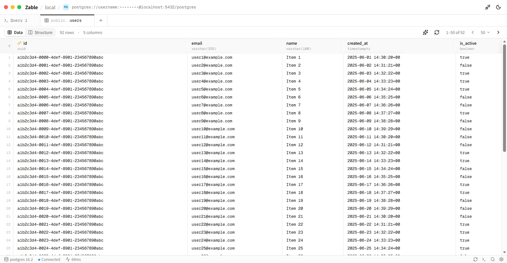

# Zable

> Another table manage gui — a fast, native database client built on [gpui](https://github.com/zed-industries/zed/tree/main/crates/gpui) and [gpui-component](https://github.com/longbridge/gpui-component).

Zable lets you connect to your databases, browse and edit tables, and run queries — all in a lightweight native app that loads instantly and stays out of your way.

## Design

Click [here](https://zable-demo.vercel.app) to see a live demo of Zable.

## Goals

- **Blazingly fast & native** — GPU-accelerated UI via gpui; instant startup, low memory, no Electron.
- **Connection management first** — add, test, and save database connections with a clean, typed config.
- **Multi-database** — start with PostgreSQL, expand to MySQL and SQLite.
- **Keyboard-driven** — every action reachable without leaving the keyboard.
- **Cross-platform** — Linux, macOS, and Windows from a single codebase.
- **Pretty, not bloated** — making rectangles look good shouldn't cost you your RAM.
